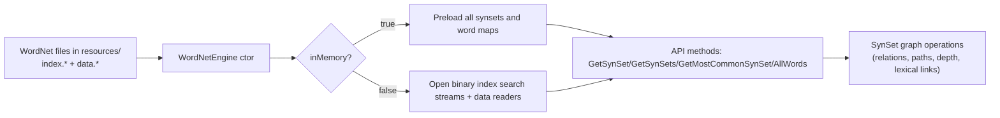
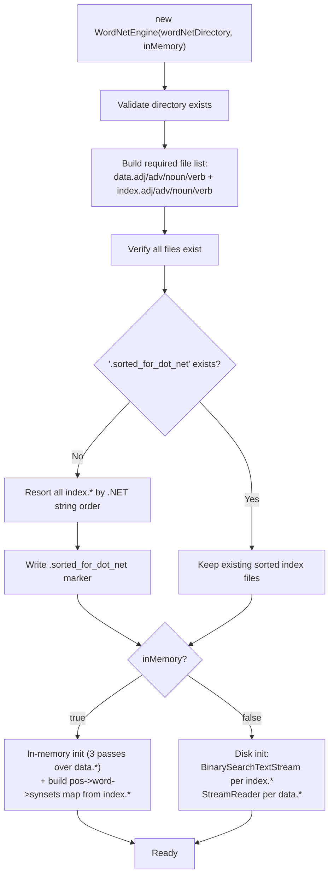
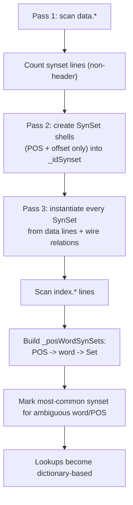
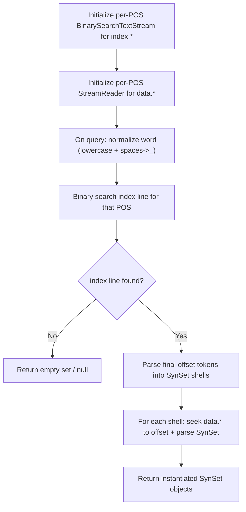
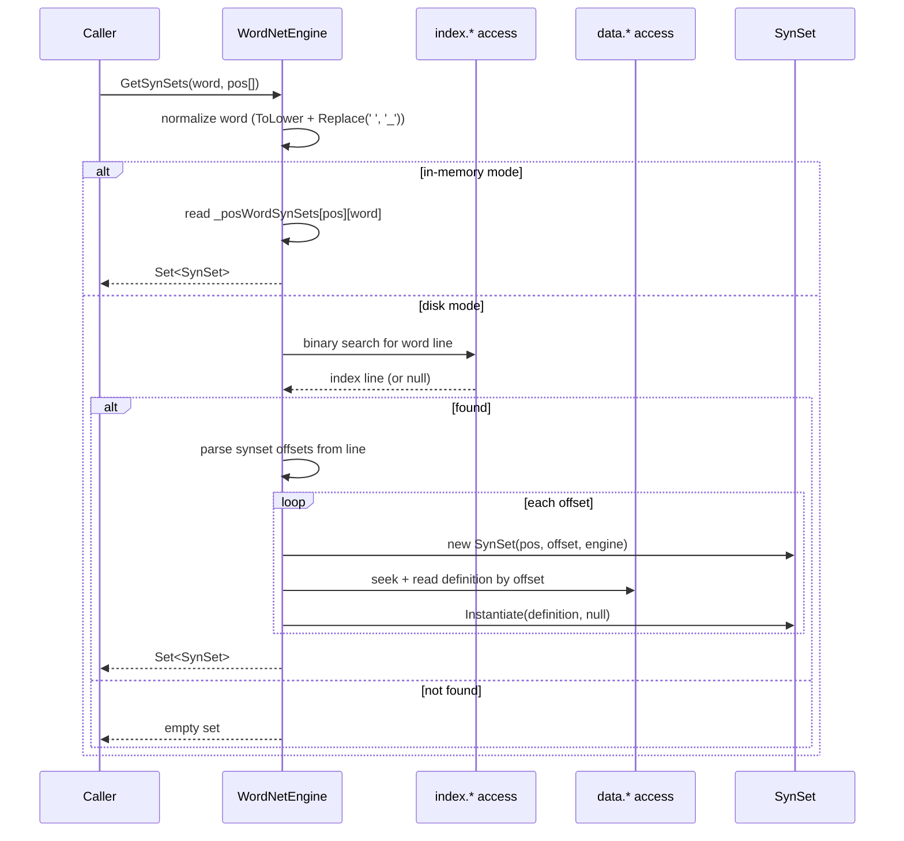
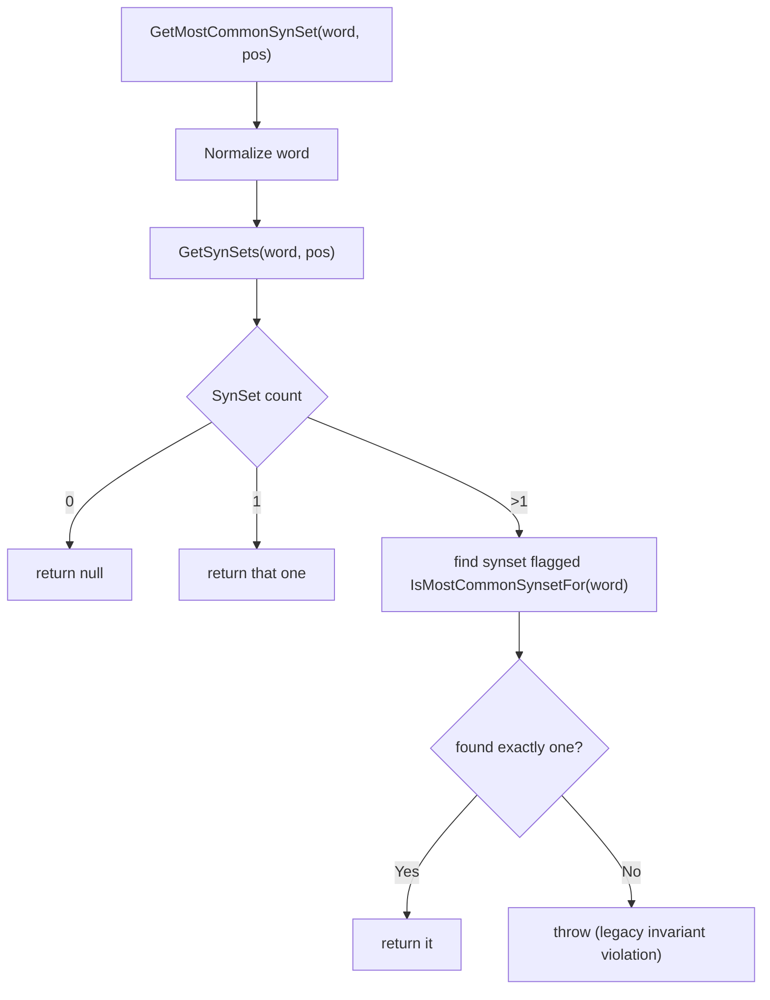
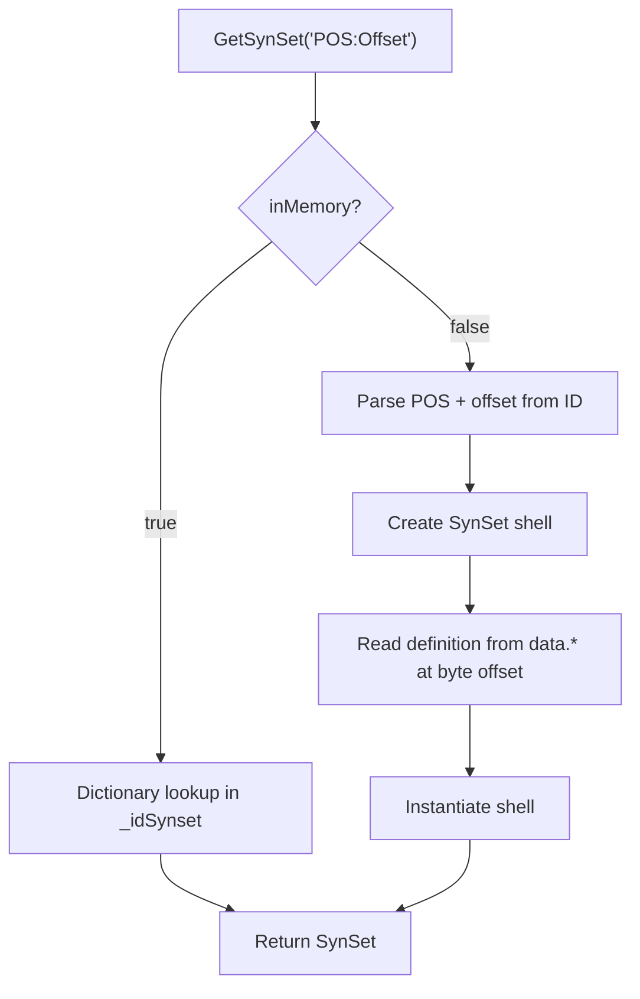
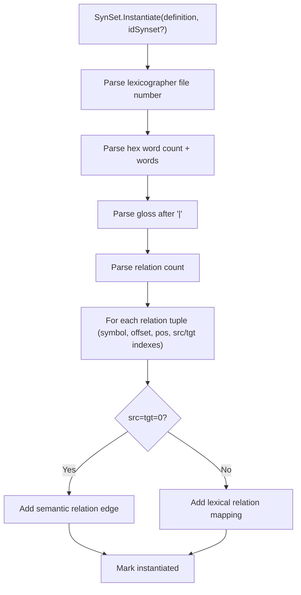

# WordNetAPI Under-the-Hood Flow

Date: 2026-03-07  
Companion to: `docs/under-the-hood.md`

## System Overview

## Engine Initialization Flow

## In-Memory Mapping (Detailed)

## Disk-Based Mapping (Detailed)

## `GetSynSets` Call Flow

## `GetMostCommonSynSet` Flow

## `GetSynSet` by ID Flow

## SynSet Internal Parsing Flow

## Practical Interpretation

- In-memory mode front-loads parsing cost for fastest repeated queries.
- Disk mode minimizes memory but does more file IO per query.
- Offsets in index lines are the bridge from lexical lookup to full synset records.
- Relation symbols are interpreted per POS, not globally.

---

## Debug Cookbook

Use this section when behavior looks wrong in production, tests, or local exploration.

## 1) "No synsets found" for a word you expect to exist

### Likely causes

- Input normalization mismatch (spaces/case are normalized, morphology is not).
- Querying wrong POS.
- Index files are not sorted for .NET but binary search is being used.
- Dataset version differs from what your expectation/examples were based on.

### Verify quickly

1. Confirm normalized query behavior:
   - compare `"new york"` vs `"New York"` (should match)
   - compare inflected form like `"running"` vs base form `"run"` (may differ)
2. Query all POS (`GetSynSets(word)` with no restriction) to rule out POS mismatch.
3. Check presence of `.sorted_for_dot_net` in the data directory.
4. Confirm the word exists in the relevant `index.*` file.

### Inspect code

- `src/WordNet/WordNetEngine.cs` (`GetSynSets`)
- `src/WordNet/WordNetEngine.cs` (constructor sorting block)

## 2) `GetMostCommonSynSet` returns `null`

### Likely causes

- No synsets exist for the normalized word+POS.
- Data mismatch or query POS is wrong.

### Verify quickly

1. Call `GetSynSets(word, pos)` first and inspect count.
2. If count is `0`, `null` is expected.
3. If count is `1`, `GetMostCommonSynSet` should return that one.
4. If count is `>1` and still failing, treat as invariant/flagging issue.

### Inspect code

- `src/WordNet/WordNetEngine.cs` (`GetMostCommonSynSet`)
- `src/WordNet/WordNetEngine.cs` (`GetSynSetShells` + flag assignment in `GetSynSets`)
- `src/WordNet/SynSet.cs` (`SetAsMostCommonSynsetFor`, `IsMostCommonSynsetFor`)

## 3) Exception: "Multiple most common synsets found"

### Likely causes

- Most-common flag set on multiple synsets for same word+POS.
- Duplicate or corrupted index ordering assumptions.

### Verify quickly

1. Rebuild the index source assumption by checking raw index line for that word.
2. Confirm offset order and no duplicate offset tokens.
3. Repeat with a fresh dataset copy.

### Inspect code

- `src/WordNet/WordNetEngine.cs` (`GetSynSetShells`, `GetMostCommonSynSet`)
- `src/WordNet/SynSet.cs` (flag storage)

## 4) Exception during constructor: missing required WordNet files

### Likely causes

- Wrong data directory.
- Partial copy of dataset.

### Verify quickly

1. Confirm these files exist in target directory:
   - `data.adj`, `data.adv`, `data.noun`, `data.verb`
   - `index.adj`, `index.adv`, `index.noun`, `index.verb`
2. Ensure app/test config points to the intended path.

### Inspect code

- `src/WordNet/WordNetEngine.cs` (constructor required-file validation)

## 5) Constructor mutates files unexpectedly

### Symptom

- First run rewrites `index.*` files and creates `.sorted_for_dot_net`.

### Why it happens

- Legacy compatibility behavior to make binary search align with .NET sort order.

### Verify quickly

1. Remove `.sorted_for_dot_net` and run once in a disposable copy.
2. Observe rewritten `index.*` and marker creation.

### Inspect code

- `src/WordNet/WordNetEngine.cs` (constructor sorting region)

## 6) `ArgumentOutOfRangeException` from substring logic in disk mode

### Symptom

- Exception around parsing current index line word in binary search callback.

### Likely causes

- Unexpected line format during search (blank/malformed line).
- Concurrency against shared stream state in disk mode tests or multithreaded use.

### Verify quickly

1. Re-run with single-threaded access.
2. Disable test parallelization if sharing one engine instance.
3. Check whether line has a space delimiter before substring assumptions.

### Inspect code

- `src/WordNet/WordNetEngine.cs` (binary search delegate in disk-mode initialization)
- `src/WordNet.Tests/MSTestSettings.cs` (if test-only symptom)

## 7) "Position mismatch" when instantiating synset by offset

### Symptom

- Exception from `GetSynSetDefinition` validating offset vs read line.

### Likely causes

- Invalid/foreign offset from index line.
- Data/index file mismatch (different WordNet version set mixed together).
- Stream position interference under concurrent disk-mode access.

### Verify quickly

1. Confirm all `data.*` and `index.*` come from same dataset snapshot.
2. Reproduce with a single-threaded, fresh engine instance.
3. Manually inspect the target `data.*` line around the offset.

### Inspect code

- `src/WordNet/WordNetEngine.cs` (`GetSynSetDefinition`)
- `src/WordNet/SynSet.cs` (`Instantiate`)

## 8) Relation parsing fails with "Unexpected POS" or missing symbol map key

### Likely causes

- Dataset contains relation symbol/POS pattern not covered by static map.
- Corrupt data line.

### Verify quickly

1. Capture the exact failing definition line.
2. Identify relation tuple symbol and related POS code.
3. Compare against static `_posSymbolRelation` mapping.

### Inspect code

- `src/WordNet/WordNetEngine.cs` (static symbol map + `GetSynSetRelation`)
- `src/WordNet/SynSet.cs` (`GetPOS`, relation loop in `Instantiate`)

## 9) Memory pressure or long startup in in-memory mode

### Likely causes

- Full preload of all synsets and relation graph is expensive.

### Verify quickly

1. Compare startup time/memory between `inMemory=true` and `inMemory=false`.
2. Profile object count for `SynSet` and relation containers.

### Inspect code

- `src/WordNet/WordNetEngine.cs` (in-memory three-pass initialization)

## 10) Slow query latency in disk mode

### Likely causes

- Per-query index search + per-synset file seek/parse.
- High relation traversal causing repeated instantiation.

### Verify quickly

1. Benchmark same query in both modes.
2. Measure cost of first call vs repeated call patterns.
3. Check if callers repeatedly query same word set (cache opportunity).

### Inspect code

- `src/WordNet/WordNetEngine.cs` (`GetSynSets`, `GetSynSetDefinition`)
- `src/WordNet/SynSet.cs` (lazy relation traversal calls)

## 11) Test flakiness in modern test runners

### Likely causes

- Legacy engine in disk mode is not safe for parallel access with shared instance.

### Verify quickly

1. Run tests with assembly-level no-parallelization.
2. Use one engine instance per test if parallelization is required.

### Inspect code

- `src/WordNet.Tests/MSTestSettings.cs`
- `src/WordNet.Tests/Test1.cs`

## 12) Quick triage checklist

When a new issue appears, run this order:

1. Confirm data directory and required 8 files.
2. Confirm `.sorted_for_dot_net` status.
3. Reproduce in single-threaded mode.
4. Compare behavior in `inMemory=false` vs `inMemory=true`.
5. Capture failing word/POS/synset ID and one raw source line from `index.*` or `data.*`.
6. Map symptom to method path in `WordNetEngine` or `SynSet`.
